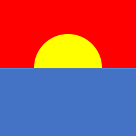
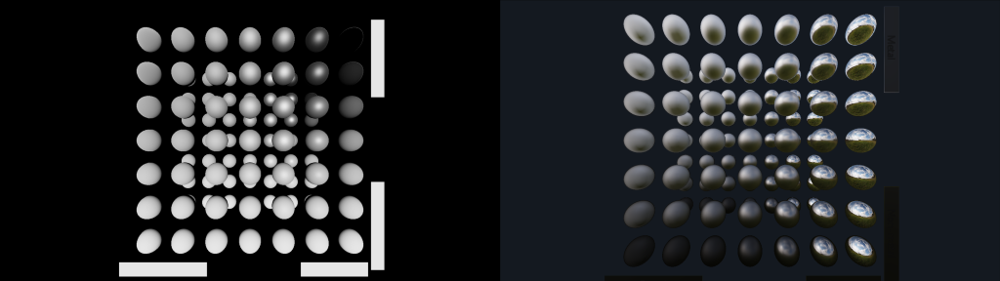
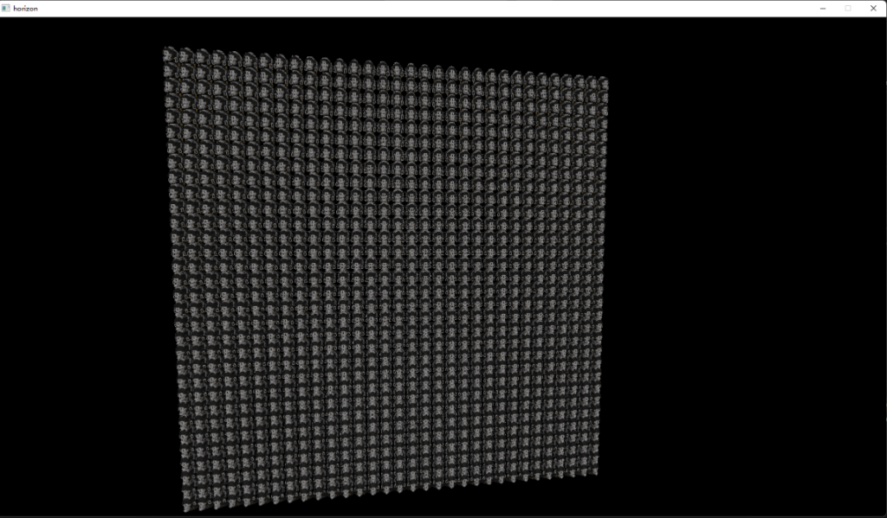
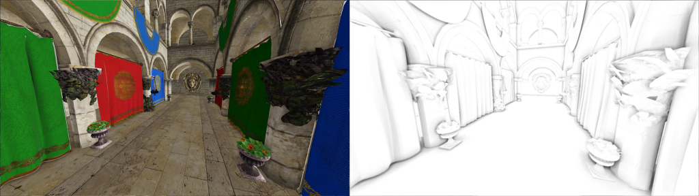
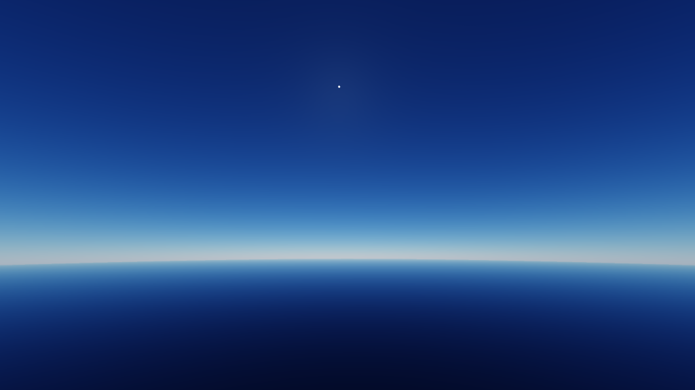
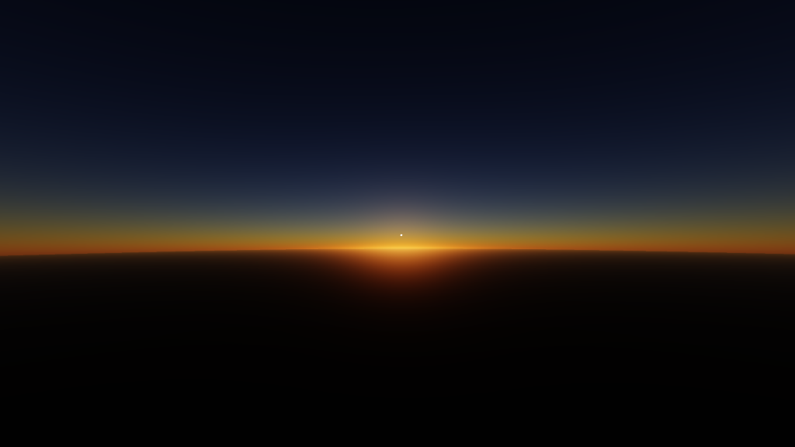

# [Horizon](https://github.com/v4vendeta/horizon/)

horizon is a real time render framework.

---

[](https://discord.gg/sc33JSBKVQ)

---

# Build From Source

**NOTES:** Horizon is not designed for cross-platform and portability, so build or run correctly on other platform is not guaranteed.

On Windows:

- Vulkan SDK 1.3
- CMake 3.18
- Git
- vcpkg

install the required package with vcpkg, you can refer to ```./horizon/3rd_party/CMakeLists.txt```.

clone the repo with

~~~
git clone https://github.com/v4vendeta/horizon.git
~~~

modify vcpkg path in CMakeLists.txt in project root directory

~~~
include(/path/to/vcpkg/scripts/buildsystems/vcpkg.cmake)
~~~


use CMkae to generate solution file

~~~
cmake . -B build
~~~

open solution **Horizon** and build all solution.

<!-- ./app.exe -config_path D:/codes/horizon/horizon/app/EngineConfig.ini -->

# Features

- Physically Based Rendering
  - physical light unit
  - physical camera and exposure
  - pbr shading with energy compensation
  - irradiance map and spherical harmonics
  - prefiltered irradiance enviroment map and split sum approximation



- GPU Instancing



- SSAO
  - ssao
  - gaussian blur
 


- Precomputed Atmospheric Scattering
  - Eric Bruneton version
 


