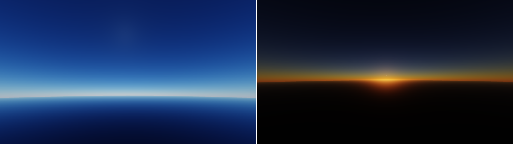
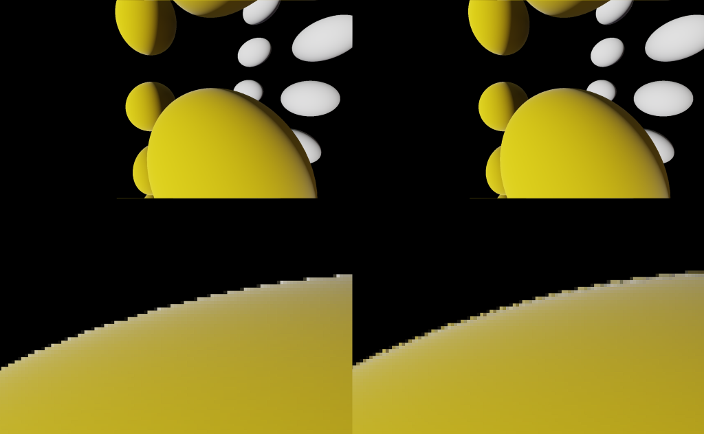

# Horizon


horizon is a real time render framework for my graduation project.

# Features

- Physically Based Rendering
  - physical light unit
  - physical camera and exposure
  - pbr shading with energy compensation
  - IBL diffuse irradiance with spherical harmonics, specular with split sum approximation
 


- SSAO
  - ssao
  - gaussian blur
 


- Precomputed Atmospheric Scattering
  - Eric Bruneton version
 


- Temoral Antialiasing



## Build status

| Platform |       MSVC        |
| -------- |:----------------: |
| Windows  |:heavy_check_mark: |


## Build From Source

On Windows:

- Vulkan SDK 1.1
- CMake 3.10
- Git

clone the branch PrecomputeAtmosphericScattering

```
git clone -b main https://github.com/hanyangl5/horizon.git --recursive
```

use CMake to generate solution file

```
cmake -D build .
```


build the project

run compile_shaders.py under project source file to compile project shaders

```
python compile_shaders.py
```

then run any samples

the app default load the sponza scene taken from [glTF-Sample-Models](https://github.com/KhronosGroup/glTF-Sample-Models/tree/master/2.0/Sponza)

## License

[MIT](LICENSE) © hanyangl5