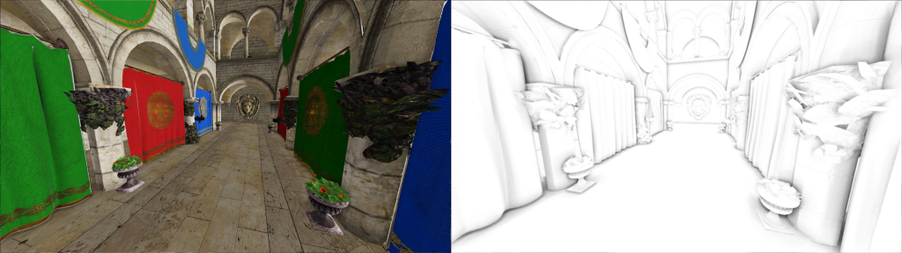
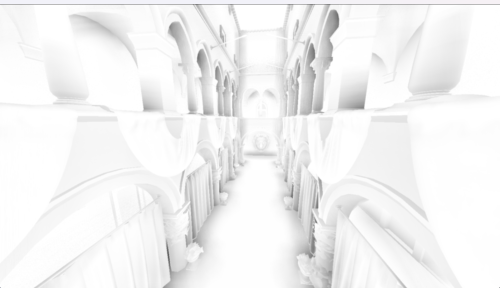

# Horizon


horizon is a real time render framework for my graduation project.

# Features

- Physically Based Rendering
  - physical light unit
  - physically based shading
  - Image Based Lighting
    - 

- Ambient Occlusion
  - ssao

  - hbao


- Precomputed Atmospheric Scattering
  - 

- Temoral Antialiasing
  - 
- Tone Mapping
  - Auto Exposure(Eye Adaption) based on average histogram luminance
## Build status

| Platform |        MSVC        |       Clang        |
| -------- | :----------------: | :----------------: |
| Windows  | :heavy_check_mark: | :heavy_check_mark: |

## Build From Source

On Windows:

- Vulkan SDK 1.1
- CMake 3.10
- Git

clone the branch PrecomputeAtmosphericScattering

```
git clone -b main https://github.com/hanyangl5/horizon.git --recursive
```

use CMake to generate solution file

```
cmake -D build .
```

build the project

compile shaders before running samples:

- **Legacy (HSL):** run `compile_shaders.py` in each sample dir (e.g. `samples/renderer_v1/`, `samples/hbao/`). The HSL compiler is **deprecated**; see `tools/HSLCompiler/DEPRECATED.md`.
- **Preferred (HLSL):** use DXC only. Run `tools/compile_hlsl/compile_hlsl.py` for HLSL samples (see `tools/compile_hlsl/README.md`). Output is SPIR-V; descriptor set layout comes from runtime reflection (spirv-reflect). Requires DXC on `PATH` or `DXC_PATH`.

then run any samples

the app default load the sponza scene taken from [glTF-Sample-Models](https://github.com/KhronosGroup/glTF-Sample-Models/tree/master/2.0/Sponza)

## License

[MIT](LICENSE) © hanyangl5
