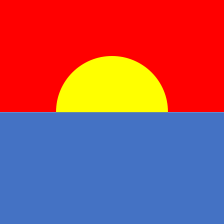
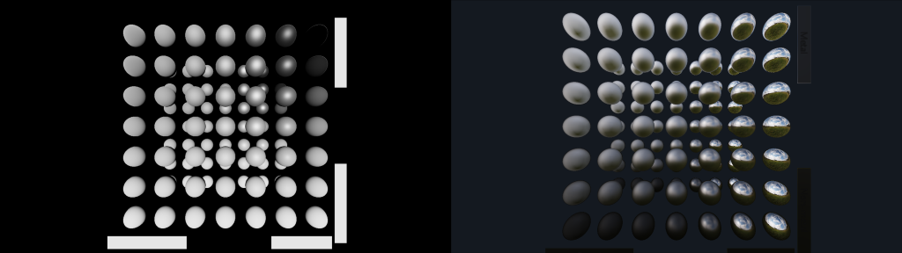

# Horizon



horizon is a real time render framework.

# Features

- DirectX12 & Vulkan Render Backend
- Bindless Resource & Indirect Draw Geometry Pipeline
- FrameGraph
- Physically Based Rendering
  - 
- Ambient Occlusion
- Deferred Rendering
- Image-Based Lighting (IBL)
- Skeletal Mesh Animation
- [Precomputed Atmospheric Scattering](https://github.com/hanyangl5/horizon/tree/PrecomputeAtmosphericScattering)
  - 
- Temporal Antialiasing
- Auto Exposure

## Build status

| Platform |        MSVC        |       Clang        |      Vulkan        |
| -------- | :----------------: | :----------------: | :----------------: |
| Windows  | :heavy_check_mark: | :heavy_check_mark: | :heavy_check_mark: |
| macOS    |                    | :heavy_check_mark: | :heavy_check_mark: |
| Android  |                    |                    | :heavy_check_mark: |

## Build From Source

### Windows

```bash
# MSVC
cmake --preset msvcwin64
cmake --build --preset msvcwin64

# Clang
cmake --preset clangwin64
cmake --build --preset clangwin64
```

### Android

Build the native framework library only (no APK):

```bash
cmake --preset android_framework
cmake --build --preset android_framework
```

Build per-sample APKs (hellotriangle, deferred, etc.):

```bash
cmake --preset android_app
cmake --build --preset android_app
```

This generates one APK per sample in `build/android_app/android/<sample>/build/outputs/apk/debug/`.

You can also build a single sample's APK:

```bash
cmake --build --preset android_app --target apk_hellotriangle
```

**Prerequisites:**

- Android NDK 27+ (path configured in `CMakePresets.json`)
- Android SDK with build-tools 36.0.0 and platform android-36
- JDK 17+

### macOS (MoltenVK)

```bash
cmake --preset macos_clang
cmake --build --preset macos_clang
```

**Prerequisites:**

- Vulkan SDK installed with MoltenVK
- Xcode Command Line Tools
- `VULKAN_SDK` points to your Vulkan SDK root (required for `find_package(Vulkan)`)
- Uses the `Xcode` generator preset

## Advanced Build

- PGO workflow and presets: `docs/pgo.md`
- LTO options and presets: `docs/lto_prd.md`

---

the app default load the sponza scene taken from [glTF-Sample-Models](https://github.com/KhronosGroup/glTF-Sample-Models/tree/master/2.0/Sponza)

## License

[MIT](LICENSE) © hanyangl5
